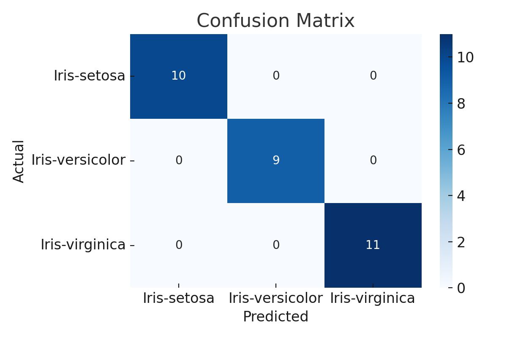

# Iris Flower Classification 🌸

This project uses machine learning to classify Iris flower species based on four features:  
- Sepal length  
- Sepal width  
- Petal length  
- Petal width  

The model was trained on the classic [Iris dataset](https://en.wikipedia.org/wiki/Iris_flower_data_set) using a **Random Forest Classifier** and achieved **100% accuracy** on the test set.

---

## 📊 Project Workflow

- Exploratory Data Analysis (EDA)
- Label Encoding
- Train-Test Split (80/20)
- Model Training using `RandomForestClassifier`
- Model Evaluation (Accuracy, Confusion Matrix, Classification Report)
- Feature Importance Visualization

---

## 📁 Files Included

- `Iris_Classification_Project.py` — Main Python script with full code  
- `confusion_matrix.png` — Model performance visualization  

---

## 📦 Libraries Used

- Python
- Pandas
- Scikit-learn
- Seaborn
- Matplotlib

---

## 📸 Confusion Matrix Output

---

## ✅ Results

- Accuracy: **100%**
- All 3 species were correctly predicted on the test set.
- Petal length and petal width were the most important features.

---

## 🚀 Author

This project was completed as part of a machine learning internship.

